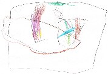

# 1.3 Las TIC en nuestro Proyecto de Trabajo

Como habéis visto en el apartado anterior, nuestro alumnado está reunido en la asamblea para la creación, reelaboración o reproducción de una historia. Una buena opción sería que el docente fuera **escribiendo** **las frases de los alumnos** utilizando diferentes diapositivas de un editor de presentaciones. Aunque no será hasta el Módulo 5 cuando utilicemos herramientas de presentación de diapositivas, elegir esta opción te supondría:

*   Ahorrar tiempo en el siguiente módulo porque ya tendrás la parte escrita.
*   Tu alumnado podrá visualizar lo que van diciendo, lo que puede ser más motivador.
*   Profundizar en la aproximación del aprendizaje de la lectoescritura, independiente de la fase en que se encuentre tu alumnado.

   fig. 4.6  Caperucita jugando a toros. Rocío Beser

Pero, como ya hemos dicho anteriormente, el objetivo de este módulo no es presentar diapositivas, sino **grabar, tratar y editar/exportar** las frases de la historia que digan nuestros alumnos. Así, pues, tras la actividad grupal, pediremos a nuestro alumnado que, de manera individual, se pongan delante de un micrófono y lean/repitan la frase que inventaron para el cuento. Aunque no es imprescindible, contar con profesorado de apoyo facilitaría la labor y ayudaría a mejorar la calidad de las grabaciones. Pincha sobre el dibujo y escucharás un **ejemplo** más.

**Nuestra misión** será grabar las frases con un editor de audio; modificarlas si no fueran de buena calidad; guardarlas y utilizarlas posteriormente con una herramienta de presentación de diapositivas (PowerPoint, Prezi, etc.), aunque esto último será tarea del Módulo 5.

Os **recordamos** que, a lo largo de todos los módulos, vamos presentando una metodología para ir desarrollando el proyecto de trabajo. Seguirla o no dependerá de vosotros, igual que lo es elegir esta o aquella herramienta TIC.

 fig. 4.7 Botón volumen de Windows. Captura pantalla propia

