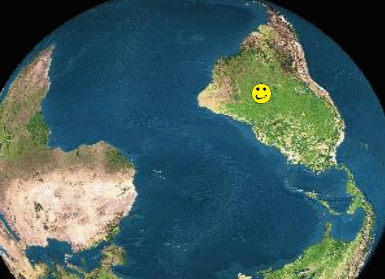

# 1.3 Las TIC en nuestro Proyecto de Trabajo

Es muy importante que hayas guardado todos los archivos de sonido e imagen que has ido creando durante el proceso. Esta **documentación** te servirá de base para editar un video que puedas utilizar a modo de evaluación y/o cierre final del proyecto. Por supuesto, eres muy libre de incluir sonidos e imágenes no vistas hasta ahora y que pueden clarificar parte de lo aprendido.

fig. 6.5 Diapositiva Ppt del P.Trabajo del CEIP Octavus

Para amalgamar los archivos de sonido e imagen vamos a utilizar la herramienta del **editor de vídeo** (Moviemaker, VideoPad, VideoEditor, etc.). Con ella vamos a incrustar imágenes, sonidos, transiciones, efectos de imágenes, y escribir títulos y créditos. Y como lo que se hace en la escuela no debe quedarse en la propia escuela, al final **publicaremos el vídeo**en la galería de Youtube.

 La única precaución que has de tener es la de no incluir las imágenes de los niños cuyos padres no han dado el **permiso de publicación de imágenes**. En caso de que la foto fuera muy interesante, siempre nos quedaría un difuminador de rostros para salvaguardar el derecho de imagen.

Si pinchas en la imagen de arriba, podréis ver un **ejemplo** de cómo se puede hacer un sencillo vídeo. El equipo de profesores hizo uno vídeo de cada actividad que culminaba una parte del proyecto de trabajo. No es lo que pedimos en este curso, pero la idea también está bien.

