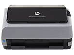

# 2.1.2 La imagen

Para digitalizar los dibujos de tus alumnos y poderlos utilizar en la presentación, tienes dos **opciones**:

  1- Coge la **cámara digital o tu móvil**; selecciona una modalidad de foto (texto, objeto, etc.); procura no hacer sombras con tu cuerpo o con cualquier objeto; y dispara. Guarda tu archivo de imagen en tu ordenador. Es fácil de hacer, pero no respondemos de la calidad de los resultados.

2- Usa el **scanner**. La mayoría de los colegios disponen de uno y, si éste fuera tu caso, te animamos a utilizar esta opción porque la calidad de la imagen va a ser superior. De lo contrario, elige la herramienta que tengas  más a mano. Pincha sobre el hipervínculo para ver los diferentes [tipos de archivos de imagen](http://office.microsoft.com/es-es/powerpoint-help/tipos-de-archivos-de-multimedia-que-puede-agregar-HP003076236.aspx "Tipos de archivo de imagen de la galería de Microsof") que se pueden crear.

Al haber muchos [tipos de scanner](http://centros5.pntic.mec.es/ies.siglo.xxi/web/ofereduc/cis/escaner/html/tipos.html "Tipos de escaneres"), y marcas (Canon, HP, Epson, Fujitsu, Kodak, Minolta, etc.), sería engorroso detallar su funcionamiento uno a uno.

A continuación te ofrecemos las **fases** por las que tendrás que pasar en la mayoría de los escáneres. De todas formas, si quisieras tener unos conocimientos previos sobre el uso del escáner, te recomendamos este manual para escanear de [J. María Gil ](http://www.uam.es/personal_pdi/stmaria/jvitalle/web_cuba/tema6/tutorial_escanear.pdf "Manual para escanear"):

1.  Apretar el botón de encendido del escáner
2.  Hacer clic en el icono que hay en el ordenador
3.  Colocar el original encuadrado encima del cristal
4.  Abierto el programa elegir lo que se quiere hacer.
5.  Aparece una visión previa, donde debemos ajustar las líneas de puntos a lo que queremos escanear de la imagen. (pgs. 6-8)
6.  Se realiza el verdadero escaneo y, terminado éste, guardamos el documento en la carpeta que quieras. (pg. 9)
7.  Pedirá si quieres continuar: selecciona SÏ si vas a escanear más originales.

Al contrario que los archivos de sonido, las **imágenes sí se incrustan** en las presentaciones, por lo que no hay necesidad de tenerlas ni en la misma carpeta que en la de la presentación, ni siquiera en el ordenador, aunque el hacerlo podría ser positivo por mera cuestión de orden. Es decir, una vez puesta en la diapositiva, puedes hacer lo que quieras con el archivo de imagen.

