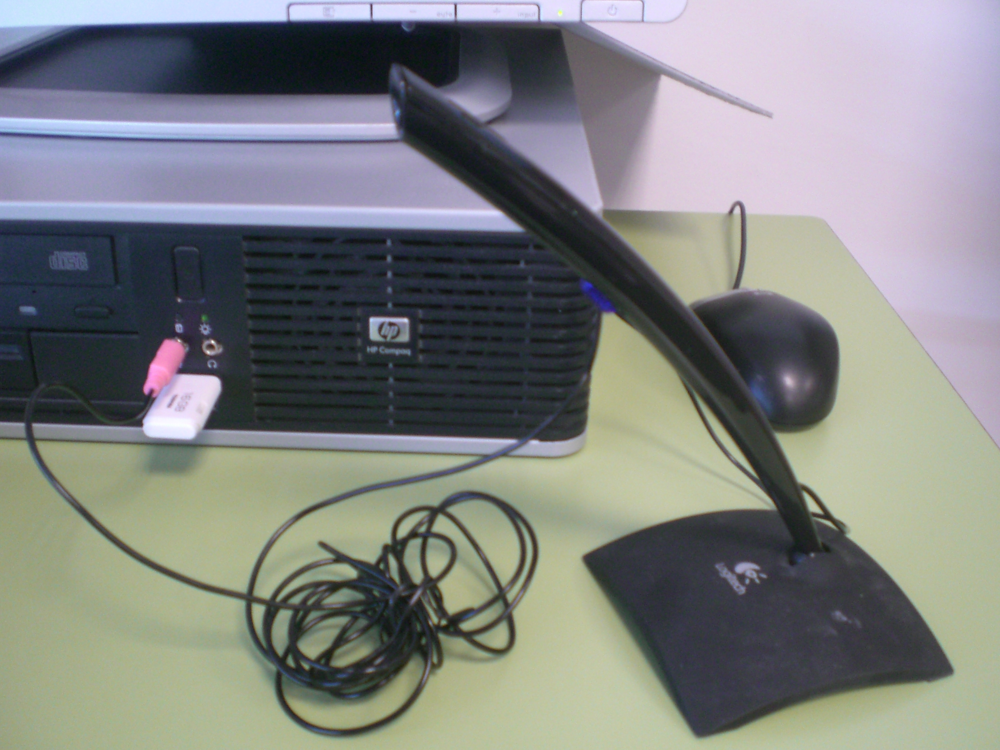

# 2.1 Los dispositivos de grabación

Hace pocos años podríamos haberte dicho que hay dos maneras de registrar un sonido: uno, mediante **soporte** analógico, y otro, mediante soporte digital. Técnicamente esta realidad no ha cambiado, pero en términos cuantitativos el hecho es que el soporte digital se ha impuesto abrumadoramente.

La grabación y reproducción digital de sonidos podemos realizarla mediante diversos **dispositivos**:

*   La **grabadora digital**, fácil de manejar y transportar, pero que podemos sustituir, si disponemos de un ordenador, por cualquier programa de grabación y edición de sonidos.
*   El **teléfono móvil,** la mayoría de los cuales tiene una aplicación de grabación que crea un archivo de sonido que se puede descargar en el ordenador. Si te interesan sus posibles aplicaciones, también en Infantil, te remitimos a la web de [Pilar Soro Mateos](https://groups.diigo.com/group/ludotak "Audio y móviles. Pilar Soro")

 

*   El **micrófono** es el dispositivo de grabación más común por ser el más económico (menos de 10 euros es asimilable por cualquier colegio). Tanto sea externo como interno al ordenador, para poder grabar se necesitará tenerlo conectado a la tarjeta de sonido del equipo, y configurarlo como dispositivo de entrada de audio. Si observas que puedes grabar sin problemas, ¡no toques nada!. Si te sucediese lo contrario, haz los cambios oportunos a partir del panel de control o el icono del volumen que suele haber en la barra inferior de la pantalla. Si tuvieras alguna dificultad te recomendamos el siguiente [videotutorial](http://www.youtube.com/watch?feature=player_detailpage&v=nocUadWc1PI "Micrófono") o sigas los diferentes caminos para **configurar el audio** que te sugerimos a continuación:

  

1.   : doble clic, “_Opciones_”, “_Propiedades_”, “_Ajustar volumen_”; o botón derecho, “_Opciones_”, “_Dispositivos de reproducción_”.

2.  “_Inicio”_, “_Dispositivos e impresoras_”. Pinchar en Nuestro equipo y “_Configuración de sonido"._

3.  “_Inicio_”, “_Paneles de Control_”: “_Sonidos_” o “_Dispositivos de sonido y audio_”, “_Voz_”

  
  

