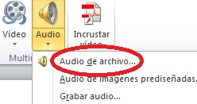

# 2.2.2 Insertar sonidos y presentación

Los sonidos puedes descargarlos a tu presentación desde:

*   Internet
*   Un Cd
*   El ordenador

Como estás trabajando con los archivos de sonido de las grabaciones de los niños, la última opción es la que emplearemos. Para ello deberás ir al menú de "_Insertar_" y pinchar sobre el icono de "_Audio"_.

   

fig. 5.20 Insertar sonido en Power Point. CPP

Lo que no debes olvidar nunca, y es la segunda vez que lo mencionamos, es tener siempre tus archivos de **sonido en la misma carpeta que tu presentación.** De no hacerlo así, no los podrás oír.

Una vez que has insertado el sonido, es muy importante configurar la **duración** del mismo para que se pueda oírse desde y hasta donde quieras y como quieras. Para concretar, léete el siguiente [tutorial](http://office.microsoft.com/es-hn/powerpoint-help/agregar-y-reproducir-sonidos-en-una-presentacion-HA001230305.aspx "Tutorial sobre sonidos en Power Point") de Microsof.

Cuando creas que todos los sonidos están debidamente situados y se escucha durante el intervalo que has fijado, haz una prueba pinchando en el menú de "**_Presentación de Diapositivas_**" y elige una de las opciones.

 fig. 5.21 Menú Presentación con diapositivas en Power Point. CPP

Si das el visto bueno, **oculta los iconos de los altavoces** para mejorar la estética de la presentación.   Pincha sobre el icono del altavoz que aparece en la diapositiva y elige una de estos caminos:

*   Botón derecho y selección la opción "_Enviar al fondo_"
*   En la barra de arriba pincha sobre "_Organizar_" y escoge el orden.

