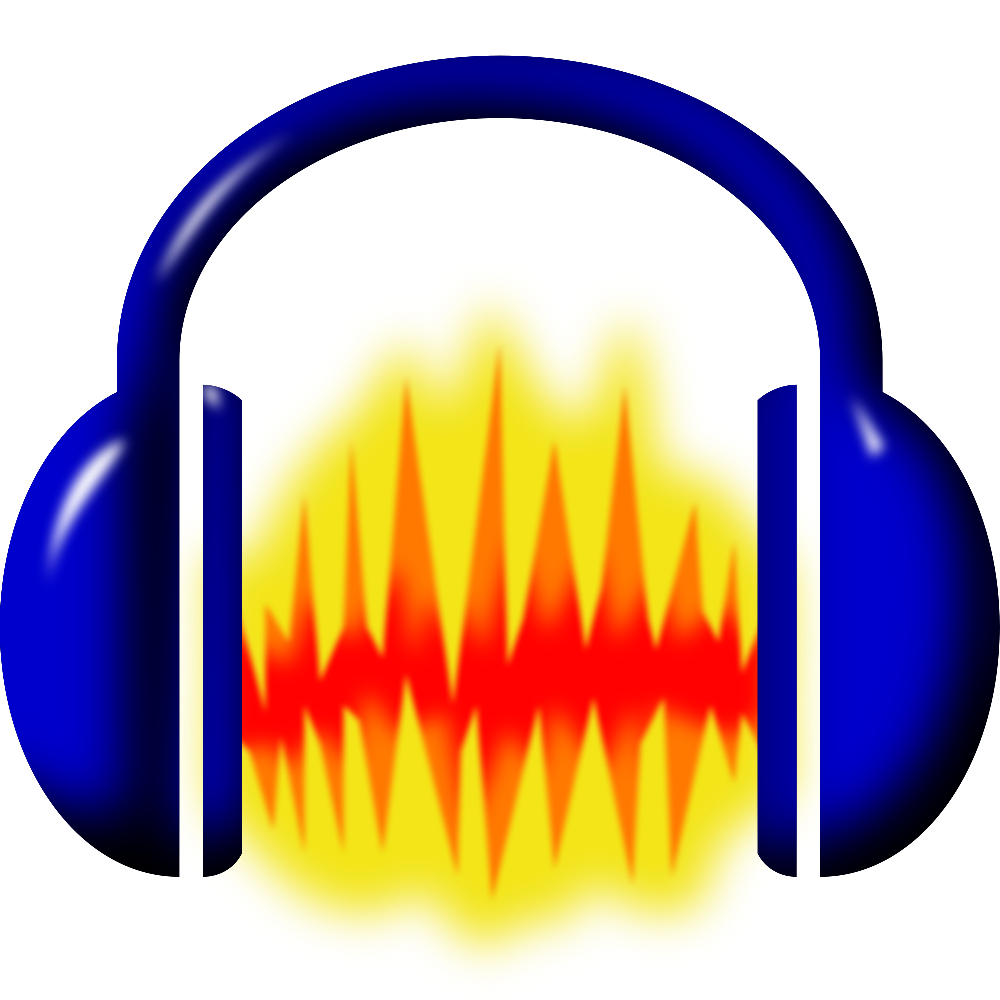

# 2.2 Audacity

 

**Audacity** es una aplicación informática multiplataforma libre que se puede usar para grabación y edición de audio, distribuido bajo licencia GPL. Tiene la ventaja de que su funcionamiento no es complicado, puede importar casi todo tipo de archivos y puedes exportar principalmente en WAV yMP3.

### **CARACTERÍSTICAS TÉCNICAS:**

*   Grabación de audio en **tiempo real.**
*   **Edición** de archivos de audio tipo Ogg Vorbis, MP3, WAV, AIFF, AU, LOF, WMP.
*   **Importación** de archivos de formato MIDI,RAW y MP3.
*   Edición de **pistas múltiples.**
*   Posibilidad de agregar **efectos** al sonido (eco, inversión, tono, etc).
*   Posibilidad de usar** plug-ins** para aumentar su funcionalidad.
*   Mejora de efectos, en especial **ecualización**, **eliminación de ruido** y normalización.   
    
*   **Recuperación** automática tras bloqueo en el caso de terminación anormal del programa.

Si no dispones de Audacity, **descárgate** la última [versión](http://audacity.sourceforge.net/download/windows "Descarga de Audacity") e instálala.

En principio, Audacity tiene problemas al **codificar archivos MP3** porque estos están patentados y no pueden ser utilizados legalmente en programas libres. Lo único que hay que hacer es obtener el codificador MP3 adecuado a tu ordenador (ver tabla de abajo) a través de la página de [LAME](http://audacity.sourceforge.net/help/faq_i18n?s=install&i=lame-mp3&lang=es "Web de Audacity"). Si tuvieras algún problema, échale un vistazo aal siguiente videotutorial.

https://www.youtube.com/watch?v=RV0G37RnJs0

* **Windowx**: Archivo **Lamev3.99.3 for windows.exe**

* **Mac OS**: Archivo **Lame Library v3.98.2**

* **Linux/Unix**: Archivo **libmp3lame.so** –su nomenclatura puede variar-

A partir de este momento podrás exportar tanto en WAV como MP3. Estos últimos ocupan una décima parte del WAV, pero para la mayoría de nosotros suena muy similar, especialmente si se reproduce usando el ordenador o a través de audífonos. De todas formas, si tuvieras algún problema, no te preocupes, porque un buen convertidor online de sonidos ([ver final 2.3.2](232_grabadoras_de_audio_online.html "Convertir sonidos"))  te podrá solucionarlo fácilmente.

