# 2.3 Alternativa: Video Pad

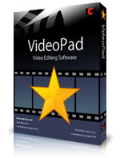    

Este programa **cubre los conceptos básicos sobre cómo editar vídeos**, incluyendo añadir sus archivos multimedia, edición, añadir efectos y transiciones, añadir o ajustar audio o narraciones y finalmente, guardar y exportar sus vídeos. Sin llegar a ser complicado su uso, es más completo que Movie Maker, aunque de formato muy parecido. El único inconveniente es que si no sabes inglés te va a limitar un poco, por lo menos al principio. Para **descargarlo** pincha [aquí ](http://www.nchsoftware.com/videopad/es/ "Descargar VideoPad"). Ten en cuenta que es una versión gratuita cuya **validez es de 15 días**, más que suficiente para que puedas editar tu película.

 Básicamente las **funciones que más nos pueden interesar** son las destacadas en la imagen superior:

1.  **Añadir** **multimedia**: para insertar vídeos, imágenes y archivos de sonido.
2.  **Subtítulos**: introducción de texto encima de la diapositiva seleccionada
3.  **Vista previa**:permitirá ver tu edición a tiempo real y en pantalla grande.
4.  **Guardar película**: lo hará en el formato de salida que elijas.

**1\. Añadir multimedia:** Los archivos seleccionados aparecerán en "_Lista de medios"_ y lo que tienes que hacer es arrastrarlos al área de edición de edición: una banda para colocar imágenes y vídeos, y tres para audio. Puedes subir varios archivos a la vez cuando estén en la misma carpeta.

 **2\. Subtítulos.** Previamente tienes que pinchar la imagen, bien sea en cualquiera de las dos ventanas de "Lista de medios", bien en el área de edición

**3\. Vista previa**. Úsala cada vez que quieras ver cómo va quedando tu edición.

**4\. Guardar película.** Tendrás que seleccionar el formato de salida (normalmente será tu ordenador) y seleccionar las diversas opciones que te da de formato de archivo, resolución y velocidad.

Importamos todas las fotos y música a nuestro proyecto de edición.Aunque no hay un **orden** fijo **para trabajar en la edición**, no estaría mal que tuvieras en consideración estas **recomendaciones**:

1.  Colocamos los archivos de imagen en la línea de tiempo.
2.  Insertamos efectos, transiciones y textos.
3.  Importamos los sonidos.
4.  Sincronizamos sonidos e imágenes. Si esto no te interesa, puedes insertar los sonidos cuando quieras.

**0\. Preparación/configuración del proyecto**

*   Ubicar los archivos en el lugar que consideres y personaliza la resolución. Si vas a colgar el video en Youtube te recomendamos una resolución de 340x240.

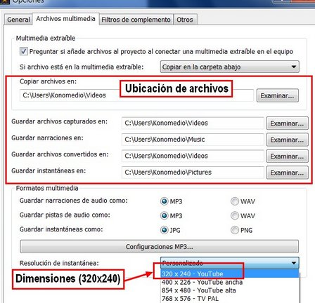

**1\. Importar clips**

Es conveniente para este tipo de proyectos tener siempre **bien organizados en carpetas los archivos que queremos utilizar** para que no andemos buscándolos por todos los sitios y perdiendo el tiempo.

*   **Clic** en el botón **Añadir Multimedia**.

*   Se abrirá una **ventana**, donde localizaremos los clips de **vídeo, música e imagen**. Seleccionamos todos. Para seleccionar todos los archivos a la vez, hacemos clic en el primero, pulsamos la tecla Mayúsculas y sin soltarla hacemos clic en el último. Ya podemos hacer **clic en Abrir** y se insertarán todos los archivos en nuestro proyecto.
*   Al hacer el clic, veremos que los archivos se han **añadido a nuestro proyecto y aparecen en la lista de medios**..

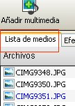

**Arrastrar clips a la línea de tiempo**

Seleccionar el primer **clip y arrastrarlo a la línea de tiempo**. También se puede hacer todos a la vez (tecla Mayúsculas).

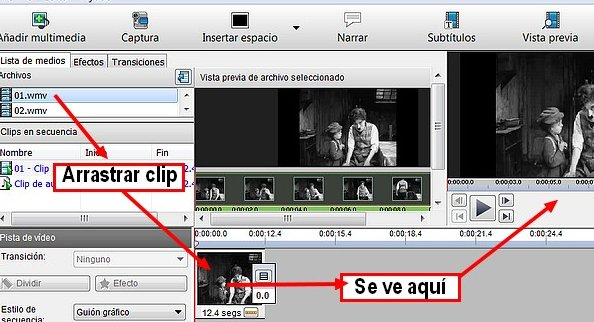  

La **duración de cada diapositiva** se puede controlar mediante:

*   La línea (roja) de tiempo del área de edición. Se desplaza con el ratón.
*   El controlador digital

 

**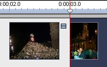**

 

*   El mismo procedimiento seguiremos con los **archivos de sonido** para realizar todas las posibilidades descritas para las imágenes.

 **2\. Crear un título**

Videopad no tienen ninguna función especial para crear títulos. Es un programa limitado en este sentido. Lo que deberemos hacer es crear un cuadro en (negro) u otro color, y luego con la función "_Narrar_", crearemos el título.

*   Clic en **Insertar Espacio**.

*   Aparecerá un **cuadro de diálogo** que nos pregunta, dónde queremos colocar el cuadro negro. Seleccionamos "**Comienzo de la línea de tiempo**".

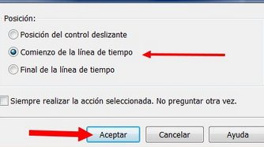   

*   El espacio en negro que hemos creado dura 3 segundos. Puedes **cambiar la duración del clip** en el marcador de tiempo "_Duración en segundos_" Al final, no olvides pinchar en "Aplicar.

*   Ahora vamos a escribir un título. Hacemos clic en el icono **Subtítulos**.
*   Aparecerá una ventana en la que **escribiremos nuestro texto** " y allí podremos cambiar los atributos del título.
*   Ajustaremos la **duración** para que sea igual que el cuadro en negro que hemos insertado. Para esto haremos clic en "_duración_" y nos aparecerá otro cuadro de diálogo en el que escribiremos la duración.

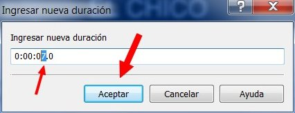

Para hacer los **títulos de créditos finales** haremos lo mismo salvo que **elegiremos "Final de la línea de tiempo"** para colocarlo al final, y luego escribiremos los títulos finales.

**Subtitular películas**.

*   Para iniciar la inserción de subtítulos pulsaremos el **botón "Subtítulos"** en la barra superior.
*   Aparece la ventana **subtítulos** en la que podemos escribir el texto, elegir la configuración, el lugar dónde lo vamos a colocar...
    *   **Iniciamos la reproducción del clip**. Cuando empiece el audio nos fijamos en el progreso del clip. Al finalizar la frase, nos fijamos de nuevo en el progreso del clip. y detenemos la reproducción. Los datos de inicio y fin no tiene que ser exactos.
    *   Pulsamos sobre la zona de escritura del subtítulo y escribimos el texto.

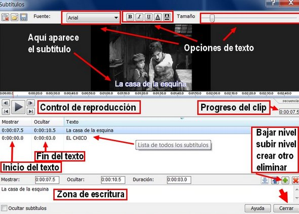

*   Para ajustar el momento en que aparecerá el texto, pulsamos sobre "**Mostrar**". Aparece un cuadro de diálogo en el que podemos ajustar hasta la décima de segundo el momento en que aparecerá el texto. Pulsamos "**Aceptar**" y reproducimos para comprobar el ajuste. Si es correcto vamos al siguiente paso y si no está bien ajustado, volvemos a editar el punto de inicio.
*   Para ajustar el punto en el que se oculta el texto, pulsamos sobre "**Ocultar**" y procedemos de la misma forma que en punto anterior. El proceso hay que repetirlo con cada una de las frases

 **3\. Previsualizar**

Antes de de exportar nuestro trabajo, lo **podemos ver todas las veces que queramos**. Hay dos procedimientos para hacer ésto:

1.  En la **ventana previsualización** del entorno de trabajo (a la derecha).
2.  En la pestaña **Ve**r: Clic en **Vista previa de pantalla competa**

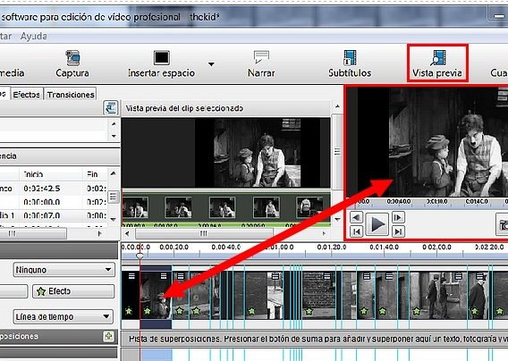 

   

En nuestra película podemos añadir **efectos y transiciones** para conseguir atractivos efectos visuales. De todas formas, no abuses de ellos. para introducirlos, tienes que seleccionar el clip y elegir en el área de la izquierda.

**4\. Guardar película.** Tendrás que seleccionar el formato de salida (normalmente será tu ordenador) y seleccionar las diversas opciones que te da de formato de archivo, resolución y velocidad. Para hacer esto último tienes que pensar en cómo vas a exhibir la película: mostrarla en clase desde tu ordenador, subirla a youtube, grabarla en un Cd, etc.

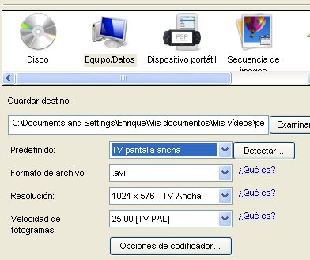  

Si tienes dudas de cómo trabajar con Video Pad o, simplemente, quieres conocer otras prestaciones te recomendamos este [tutorial ](http://www.slideshare.net/Leonardarijo/video-pad "Tutorial sobre Video Pad")de Leonar Arijo o el videotutorial de Heriberto.

  

# **Para saber más**

**Doblar el sonido de una película**

**1\. Eliminar sonido**

Puede que hayas insertado algún vídeo y no te interese conservar su sonido. Así es que, antes de doblar el sonido de un clip, debemos aprender a **eliminar el sonido del mismo**.

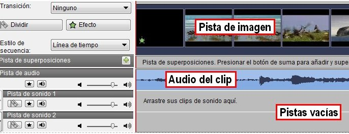 

Tenemos dos métodos para eliminar el audio:

* Bajar el sonido de la pista.
* Eliminar todo el sonido.

#### **Bajar el sonido** de la pista.

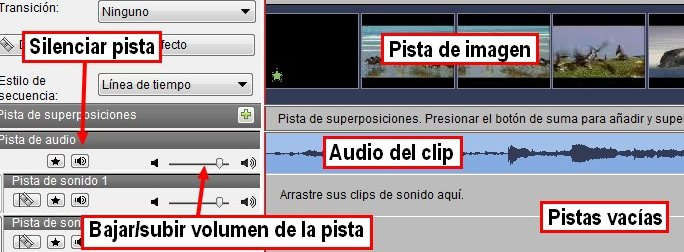  

#### **Eliminar** la pista de sonido:

*   **Separar la pista de vídeo** y sonido. Clic con el ratón encima de la pista. Aparece este menú:
*   Al hacer clic observarás que la canción se ha desplazado a la pista de abajo. Si haces otra vez clic con el botón derecho, saldrá este menú, hacemos clic en "**Quitar video seleccionado**" y se eliminará la música.

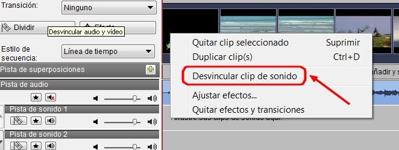   

### 2. Grabar narración

1.  Hacemos **clic en Narrar**. La grabación nos permite ver las imágenes mientras hablamos y esto facilita la coordinación audio-vídeo.
2.  Se abre un grabador de sonidos que, simultáneamente, proyecta el vídeo. El mando de esta grabadora es sumamente intuitivo, los tres botones típicos (“Record”, “Pause” y “Stop”) controlan el proceso. 
3.  Al acabar pulsamos el botón “**Cerrar**” y tendremos un archivo MP3 para incorporar a nuestro vídeo “mudo”.
4.  La pista de **audio quedará incorporada directamente** a la lista de medios (también se guarda en la carpeta que hemos indicado en el proceso).

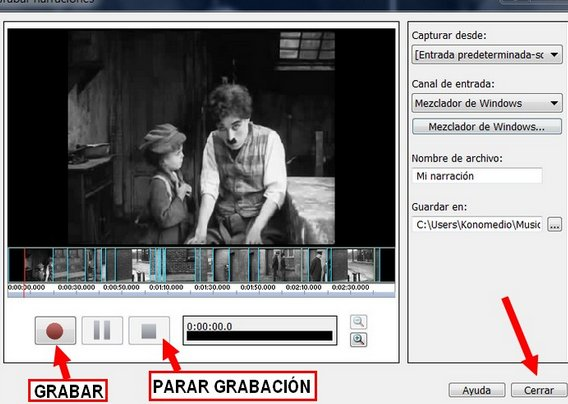 

