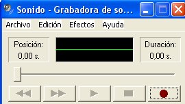

# 2.3 Alternativas a Audacity

Por supuesto, Audacity no es el único programa de edición de sonidos gratis que puedes encontrar, y, por eso, si eres una persona inquieta, te recomendamos que pinches en el enlace de la imagen  para conocer **otros programas**. De todas formas, comprobarás que el funcionamiento de todos estos programas de edición es muy parecido, variando las prestaciones que ofrece cada uno

fig. 4.15 Logo Todoprogramas. Web oficial

4.16 Grabadora sonidos Windows. Captura pantalla propia

Una alternativa a todo lo que has visto hasta ahora la puedes localizar  dentro de los programas de **Windows: la Grabadora de sonidos.** Éste es un programa que permite grabar sonidos a través de un micrófono. Es una herramienta muy sencilla, aunque con el inconveniente que sólo puedes grabar hasta 60 segundos, no tiene muchas prestaciones y sólo guarda como extensión .WAV. Para más información pasa al subapartado [2.3.1](231_grabadora_de_sonidos_de_windows.html)

Hasta ahora te hemos presentado herramientas para grabar audios que, en definitiva ,sonprogramas instalados en nuestro equipo: Audacity y la grabadora de sonidos de Windows. Así, pues, como en la mayoría de los módulos, también te vamos a ofrecer una **alternativa online**  en el apartado [2.3.2](232_grabadoras_de_audio_online.html) que facilite tu proceso de grabación, y que vamos a materializar en tres aplicaciones: Online voice recorder, Vocaroo y Apower soft audio recorder. 

 

fig. 4.17 Logo online voice recorder. Web oficial

 

